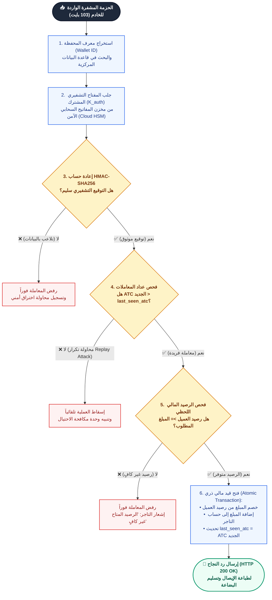
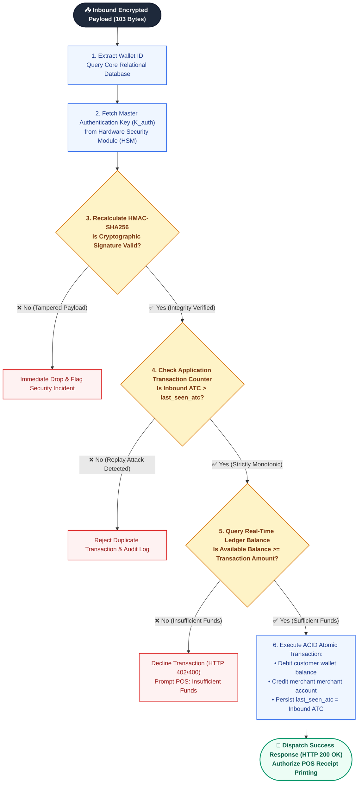
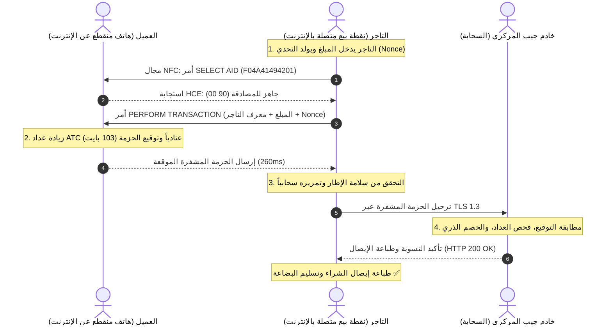
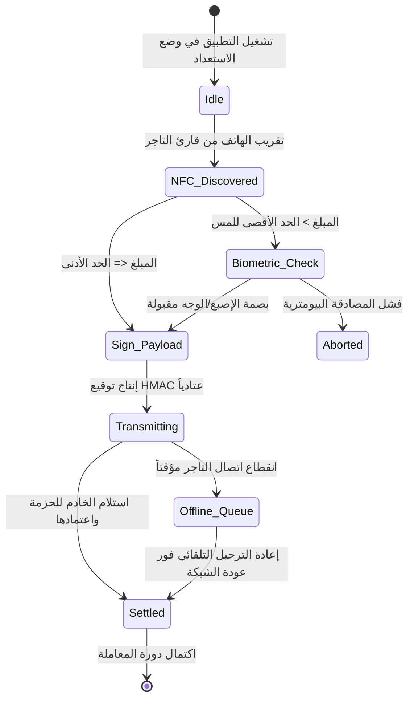

# Architectural Diagrams & Visual Engineering Guide (دليل المخططات المعمارية والتدفقات الحقيقية)

This guide defines the engineering standards for diagrams, flowcharts, sequence interactions, and state machines in research deliverables generated by `professional-researcher`.

---

## 🚫 ZERO-TOLERANCE RULE: NO ASCII / TEXT DIAGRAMS

> [!IMPORTANT]
> **STRICT BAN ON TEXT-BASED & ASCII DIAGRAMS (منع مخططات النصوص والـ ASCII نهائياً)**
> - **NEVER** use ASCII art, unicode box-drawing characters (`│`, `┌─┐`, `└─┘`, `├──`, `└──`), or vertical arrows (`▼`, `▲`, `►`, `|`) inside code blocks or plaintext to illustrate a process, flowchart, decision tree, or architecture.
> - Plaintext and monospace code blocks reverse and break Arabic letters, invert punctuation, disconnect arrows, and look amateurish.
> - **ALWAYS** produce **REAL VISUAL DIAGRAMS** using **Mermaid (` ```mermaid `)**.

---

## 🎨 Professional Mermaid Design Principles

Every diagram generated in `professional-researcher` must look like a publication-grade system blueprint:
1. **Semantic Color-Coding**: Use `classDef` to visually distinguish Start/End nodes, Processing steps, Verification Decisions, Success outcomes, and Security/Fraud Rejections.
2. **Double-Quoted Labels**: Always wrap node text in double quotes `["..."]` to guarantee 100% crash-free parsing in both Arabic and English.
3. **Descriptive Branches**: Every decision diamond `{"...?"}` must have clear, labeled branches (e.g. `-- "نعم (Yes)" -->` and `-- "لا (No)" -->`).
4. **Grouped Subgraphs**: Group distributed subsystems into clean subgraphs (`subgraph Client ["طرف العميل"]`, `subgraph Server ["الخادم السحابي"]`).

---

## 🏛️ Palette & Class Styling Standard

Include these standardized `classDef` tokens in flowcharts for consistent executive aesthetics:

```mermaid
flowchart TD
    classDef startEnd fill:#1e293b,stroke:#0f172a,stroke-width:2px,color:#ffffff,font-weight:bold;
    classDef process fill:#eff6ff,stroke:#2563eb,stroke-width:1.5px,color:#1e3a8a;
    classDef decision fill:#fef3c7,stroke:#d97706,stroke-width:1.5px,color:#78350f,font-weight:bold;
    classDef successNode fill:#ecfdf5,stroke:#059669,stroke-width:2px,color:#065f46,font-weight:bold;
    classDef rejectNode fill:#fef2f2,stroke:#dc2626,stroke-width:1.5px,color:#991b1b;
```

---

## 📋 Production Blueprint 1: Financial Verification & Transaction Flowchart (Arabic)



---

## 📋 Production Blueprint 2: Financial Verification Flowchart (English)



---

## 📋 Production Blueprint 3: End-to-End Sequence Diagram (Bilingual)

### Arabic Protocol Handshake:


---

## 📋 Production Blueprint 4: State Machine Diagram (`stateDiagram-v2`)


