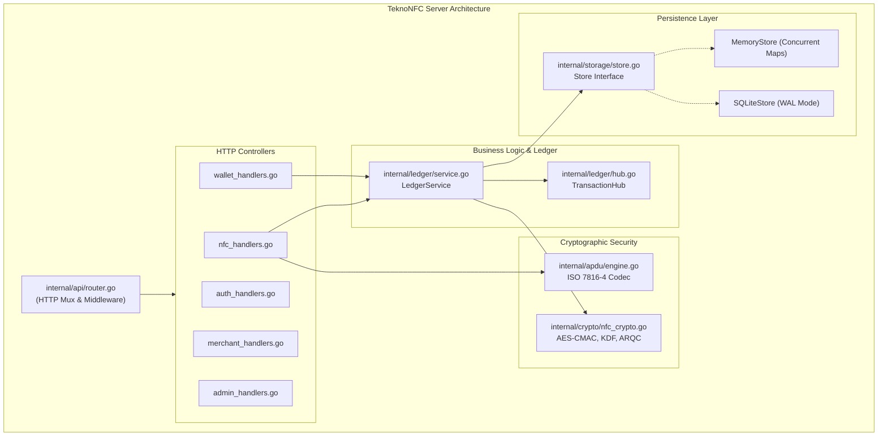

# TeknoNFC — System Overview & Architecture

> **Document ID**: `00_OVERVIEW_AND_ARCHITECTURE`  
> **Classification**: Bank-Grade FinTech Architectural Specification  
> **Standards Compliance**: PCI DSS v4.0.1 • EMV Contactless • NIST SP 800-38B • ISO/IEC 7816-4  
> **Generated By**: Full-Project Documenter Skill (Zero-Omission Engine)

---

## 1. Executive Summary & Purpose

### 1.1 Project Mission
**TeknoNFC** is a bank-grade, high-performance Near Field Communication (`NFC`) and Host Card Emulation (`HCE`) payment switch and double-entry transaction ledger. It orchestrates contactless smartphone-to-POS (`Point of Sale`) taps, Person-to-Person (`P2P`) tap transfers, physical smartcard transactions, and digital wallet issuance with microsecond latency, zero floating-point calculation errors, and strict side-channel cryptographic immunity.

### 1.2 Target Audience & End Users
1. **Retail Merchants & POS Terminals**: Android POS devices (Sunmi, Telpo, PAX) and SoftPOS handsets accepting contactless taps.
2. **Consumers & Cardholders**: Smartphone users running mobile banking wallets using HCE (`HostApduService`) emulating ISO/IEC 14443-4 Type A cards.
3. **FinTech Administrators & Compliance Officers**: Risk operators monitoring transaction velocity, relay attacks, and reserve balances.
4. **Acquiring Gateway Switches**: Core banking ledgers interfacing via ISO 8583 / JSON financial protocols.

### 1.3 Core Value Proposition
- **Two-Phase Authorization & Confirmation**: Taps create a pending state (`PENDING_CONFIRMATION`) without immediate deduction; cardholders verify transactions on their personal device.
- **Relay Attack Mitigation**: Contactless taps enforce sub-500ms round-trip time (`RTT`) boundaries to eliminate proxy relay relayers.
- **Strict Monotonicity Counter Checking**: Application Transaction Counter (`ATC`) sequencing rejects replay attempts.
- **Real-Time POS Notification**: In-memory pub/sub channels (`TransactionHub`) notify merchant POS terminals within 50ms of customer approval via long-polling or Server-Sent Events (`SSE`).
- **Zero-CGO Pure Go Deployment**: Single static Linux AMD64 binary with embedded admin dashboard and pure Go SQLite in WAL mode.

---

## 2. Technology Stack Taxonomy

| Layer | Technology / Component | Version / Standard | Purpose & Role |
| :--- | :--- | :--- | :--- |
| **Runtime & Language** | Go (Golang) | `1.25` / `1.22+` | Compiled daemon running persistent high-concurrency event loops |
| **Contactless RF Protocol** | ISO/IEC 14443-4 Type A | ISO Standard | Proximity contactless RF transmission framing |
| **Smartcard APDU** | ISO/IEC 7816-4 | ISO Standard | Application Protocol Data Unit command/response parsing |
| **Cryptographic Primitives**| AES-128 CMAC, KDF | NIST SP 800-38B | Session key derivation and dynamic ARQC/TC verification |
| **Comparison Primitives** | `crypto/subtle` | Go Standard Lib | Constant-time comparisons resisting side-channel timing attacks |
| **Database & Persistence** | Pure Go SQLite (CGO-free)| `modernc.org/sqlite` | ACID ledger storage in Write-Ahead Logging (`WAL`) mode |
| **Web & Static Embedding** | `embed.FS` | Go Standard Lib | Zero-footprint single-binary asset delivery |
| **Real-Time Push Engine** | Native Channels & SSE | In-Memory Go | Low-latency terminal status updates without external Redis |
| **Static Compliance Tool** | Custom AST Linter | `cmd/audit` | Static analysis enforcing bank-grade currency and security invariants |

---

## 3. High-Level Architectural Topology (C4 Model)

### 3.1 System Context Diagram (C4 Level 1)
```mermaid
graph TB
    subgraph Users ["Actors & External Endpoints"]
        Customer["Customer Smartphone (HCE Applet)"]
        Merchant["Merchant POS Terminal / Cashier Handset"]
        Admin["Super Admin & Compliance Auditor"]
    end

    subgraph TeknoNFC ["TeknoNFC Contactless Gateway"]
        APIEngine["HTTP API & APDU Routing Router"]
        Ledger["Ledger & Cryptogram Verification Service"]
        Storage["ACID Ledger & Account Store (SQLite/Memory)"]
        EventHub["Real-Time Transaction Event Hub"]
    end

    Customer -->|1. Tap (HCE APDU / ARQC)| Merchant
    Merchant -->|2. POST /api/nfc/pay| APIEngine
    Merchant -->|3. GET /api/nfc/status?wait=30| EventHub
    Customer -->|4. POST /api/nfc/confirm| APIEngine
    Admin -->|Manage Wallets & Audits| APIEngine
    APIEngine --> Ledger
    Ledger --> Storage
    Ledger --> EventHub
```

### 3.2 Container Architecture & Module Boundaries (C4 Level 2)


---

## 4. Repository Directory Structure & File Map

```text
d:\teknoKeys\GO-NFC/
├── cmd/
│   ├── audit/
│   │   └── main.go                  # Senior Go FinTech static analyzer (100/100 compliance scanner)
│   └── server/
│       └── main.go                  # Application entry point, environment loading, daemon lifecycle
├── internal/
│   ├── apdu/
│   │   ├── engine.go                # ISO/IEC 7816-4 APDU command/response framing and BCD math
│   │   ├── tlv.go                   # BER-TLV (Tag-Length-Value) parsing and serialization
│   │   └── apdu_test.go             # Unit tests for APDU SELECT and GENERATE AC
│   ├── api/
│   │   ├── admin_handlers.go        # Super Admin metrics, balance adjustments, key rotation
│   │   ├── auth_handlers.go         # Registration, authentication, session tokens, card provisioning
│   │   ├── merchant_handlers.go     # Merchant registration, terminal enrollment, profile lookups
│   │   ├── nfc_handlers.go          # Tap processing, challenges, two-phase confirmation, long-polling
│   │   ├── response.go              # Standardized JSON response envelope (WriteJSON, WriteError)
│   │   ├── router.go                # HTTP multiplexer initialization and route binding
│   │   ├── wallet_handlers.go       # Wallet balances, top-ups, reversals, and user-scoped logs
│   │   └── api_test.go              # Complete end-to-end HTTP integration test suite
│   ├── crypto/
│   │   ├── nfc_crypto.go            # AES-128 CMAC, session KDF, ARQC verification, CSPRNG nonces
│   │   └── crypto_test.go           # RFC 4493 test vectors, odd-byte truncation, ARQC derivation
│   ├── ledger/
│   │   ├── hub.go                   # In-memory pub/sub TransactionHub for real-time notifications
│   │   ├── service.go               # Double-entry ledger settlement, velocity checks, relay defenses
│   │   └── ledger_test.go           # Ledger business rules, monotonicity, and velocity test vectors
│   └── storage/
│       ├── models.go                # Domain entities: User, Transaction, NfcChallenge
│       ├── store.go                 # Store repository interface & thread-safe MemoryStore
│       ├── sqlite_store.go          # Pure Go SQLite driver implementation, auto-migrations, WAL
│       └── sqlite_test.go           # SQLite database schema, migrations, and concurrency tests
├── web/
│   ├── embed.go                     # In-memory asset embedding (embed.FS)
│   └── static/
│       ├── index.html               # Responsive single-page admin portal & POS simulator
│       ├── css/style.css            # Dark mode glassmorphism UI styling
│       └── js/app.js                # Frontend client logic, HCE simulation, long-polling client
├── go.mod                           # Go module definition and dependencies
├── go.sum                           # Cryptographic checksums for dependencies
├── go-nfc-linux                     # Production Linux AMD64 ELF compiled binary
├── go-nfc.exe                       # Production Windows compiled executable
├── DEPLOY.md                        # Production VPS deployment runbook and systemd configuration
└── FRONTEND_API_UPDATES.md          # Frontend and Flutter integration guide
```

---

## 5. Architectural Invariants & Design Principles

1. **Fixed-Point Financial Mathematics**: Floating-point values (`float32`, `float64`) are strictly forbidden for currency balances. All ledger computations utilize integer minor units (cents) or fixed-point decimal string transformations.
2. **Strict Cryptographic Constant-Time Comparison**: Cryptograms, message authentication codes (`MAC`), Application Request Cryptograms (`ARQC`), confirmation tokens, and passwords must be validated using `crypto/subtle.ConstantTimeCompare` to prevent timing analysis leakage.
3. **Application Transaction Counter (ATC) Monotonicity**: Every contactless card tap must increment the card's ATC. The ledger immediately aborts and logs a security alert if `incoming_atc <= last_atc`.
4. **Sub-500ms Relay Attack Timing Bounds**: Contactless tap round-trip latency (`RTT`) is tracked; transactions exceeding 500ms are flagged as `RELAY_SUSPECTED`.
5. **Two-Phase Confirmation & Zero Automatic Bypass**: Contactless taps default to `PENDING_CONFIRMATION` holding funds intact until authenticated customer confirmation via code, token, or session PIN.
