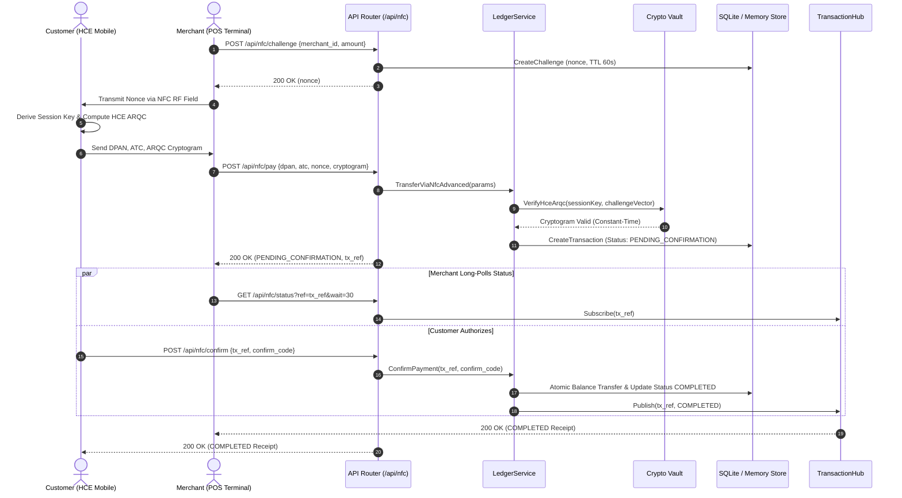
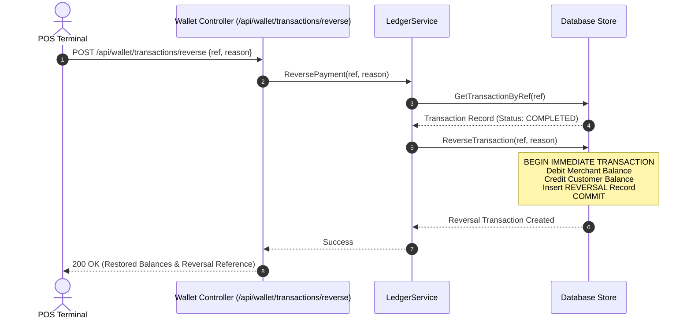

# TeknoNFC — Feature Specifications

> **Document ID**: `01_FEATURE_SPECIFICATION`  
> **Classification**: Functional & Technical Feature Matrix  
> **Generated By**: Full-Project Documenter Skill (Zero-Omission Engine)

---

## 1. Master Feature Matrix

| Feature ID | Feature Name | Primary Endpoint / Mechanism | Service Handler | Data Models | Security Controls |
| :--- | :--- | :--- | :--- | :--- | :--- |
| `FEAT-01` | **Contactless Tap Payment** | `POST /api/nfc/pay` | `LedgerService.TransferViaNfcAdvanced` | `Transaction`, `User` | AES-128 ARQC, ATC Monotonicity, RTT < 500ms |
| `FEAT-02` | **Two-Phase Confirmation** | `POST /api/nfc/confirm` | `LedgerService.ConfirmPayment` | `Transaction`, `User` | Constant-Time Token Match, 300s TTL, Atomic Commit |
| `FEAT-03` | **Real-Time POS Notification**| `GET /api/nfc/status`, `/events`| `NFCHandler.CheckPaymentStatus` | `TransactionHub`, `Transaction`| Goroutine Channels, Clean Unsubscribe on Disconnect |
| `FEAT-04` | **Payment Cancellation** | `POST /api/nfc/cancel` | `LedgerService.CancelPayment` | `Transaction` | Atomic State Transition to CANCELLED |
| `FEAT-05` | **HCE Card Provisioning** | `POST /api/wallet/hce/provision`| `WalletHandler.HceProvision` | `User` (DPAN, MasterKey) | Tokenized DPAN, Strong Random AES Master Key |
| `FEAT-06` | **Challenge Nonce Engine** | `POST /api/nfc/challenge` | `NFCHandler.CreateChallenge` | `NfcChallenge` | CSPRNG 64-bit Nonce, 60s TTL, Single-Use Invalidation |
| `FEAT-07` | **Automated Reversals** | `POST /api/wallet/transactions/reverse`| `LedgerService.ReversePayment` | `Transaction`, `User` | Atomic Balance Restoration, Idempotent Check |
| `FEAT-08` | **Merchant Activation** | `POST /api/wallet/merchant/activate` | `MerchantHandler.ActivateMerchant` | `User` (`is_merchant`, `mid`) | Strict MCC Format, MID Generation |
| `FEAT-09` | **Terminal Enrollment** | `POST /api/wallet/merchant/terminals` | `MerchantHandler.RegisterTerminal` | `Terminal` (`tid`) | Unique TID Generation, Merchant Ownership |
| `FEAT-10` | **User Transaction Scoping** | `GET /api/wallet/my-transactions` | `WalletHandler.MyTransactions` | `Transaction` | IDOR Protection, Bearer Token Scoping |
| `FEAT-11` | **Admin Balance Adjustment** | `POST /api/admin/users/balance` | `AdminHandler.AdjustBalance` | `Transaction`, `User` | Super Admin Bearer Token, Audit Reason |
| `FEAT-12` | **Cryptographic Key Rotation**| `POST /api/admin/users/rotate-keys` | `AdminHandler.RotateKeys` | `User` | Super Admin Only, Secure Random Key Gen |
| `FEAT-13` | **Velocity Rate Limiting** | Internal Ledger Guard | `LedgerService.TransferViaNfcAdvanced` | `Transaction`, `User` | Max 5 tx/min, Immediate Account Suspension |
| `FEAT-14` | **Relay Attack Mitigation** | Internal Ledger Guard | `LedgerService.TransferViaNfcAdvanced` | `Transaction` | Max 500ms RTT Boundary, Rejection Alert |
| `FEAT-15` | **ISO 7816-4 APDU Routing** | `POST /api/nfc/apdu` | `NFCHandler.ProcessAPDU` | `apdu.ParsedAPDU` | SELECT AID & GENERATE AC BER-TLV Codec |

---

## 2. Detailed Feature Workflows

### 2.1 Contactless Tap & Confirmation (`FEAT-01` & `FEAT-02`)



---

### 2.2 Automated Transaction Reversal (`FEAT-07`)

When a merchant terminal experiences a printer jam, network timeout, or customer cancellation after approval, the terminal dispatches a reversal:



---

### 2.3 User-Scoped Transaction Isolation (`FEAT-10`)

1. **Authentication**: Client presents `Authorization: Bearer <user_id>|<hash>`.
2. **Context Resolution**: Middleware parses user identity.
3. **Authorization Check**:
   - If user is `IsAdmin == true`: Permitted to query any user's logs (`/api/wallet/transactions?user_id=X`).
   - If user is non-admin: Restricted strictly to their own account. Querying `?user_id=Y` triggers an instant `403 Forbidden` response.
4. **SQL Execution**:
   ```sql
   SELECT id, ref, sender_id, receiver_id, amount, currency, status, created_at
   FROM transactions
   WHERE sender_id = ? OR receiver_id = ?
   ORDER BY id DESC LIMIT ?
   ```
