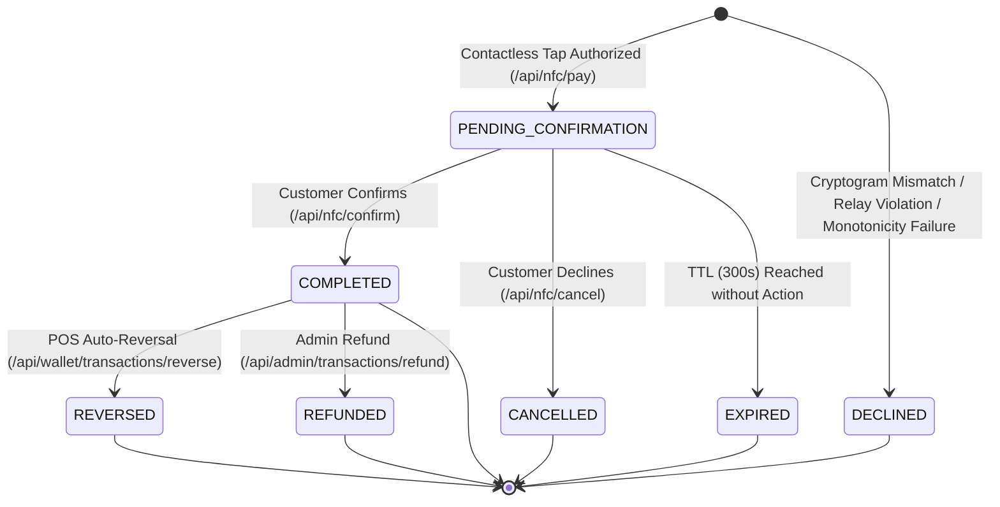
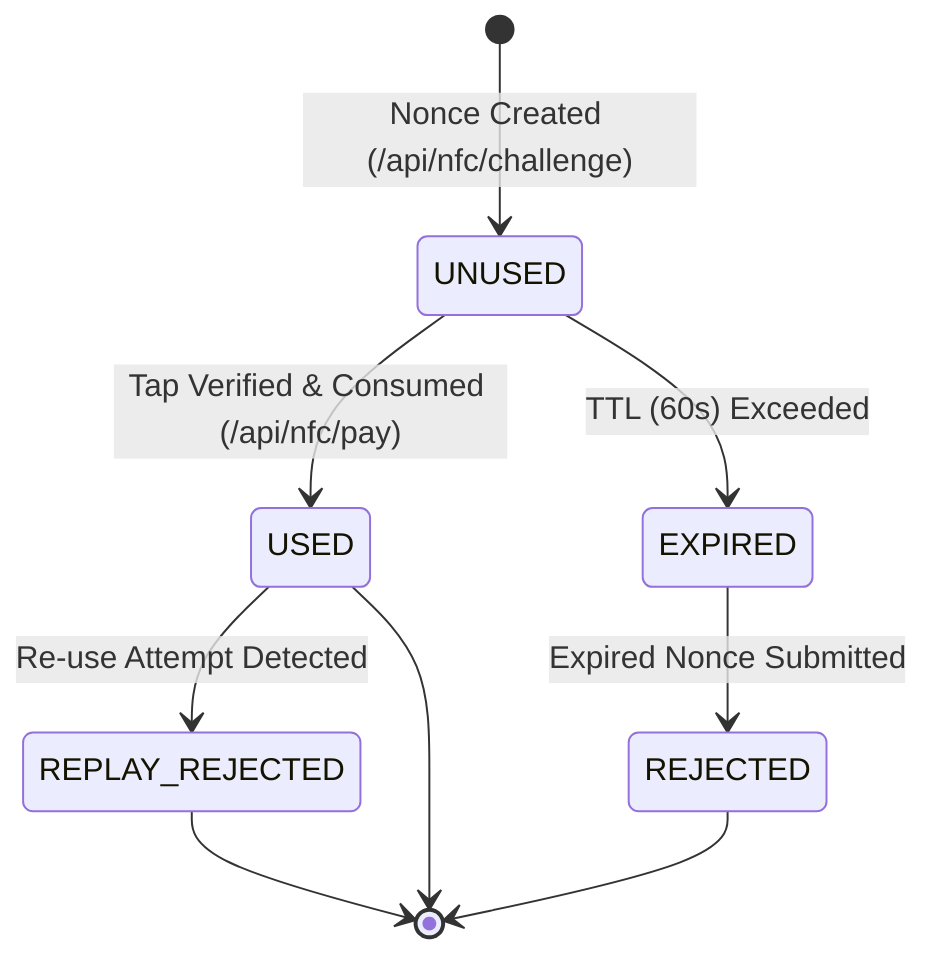

# TeknoNFC — System Data Flows & State Machines

> **Document ID**: `02_SYSTEM_DATA_FLOWS`  
> **Classification**: Dynamic Runtime Behavior, Concurrency, & Pipeline Specifications  
> **Generated By**: Full-Project Documenter Skill (Zero-Omission Engine)

---

## 1. Transaction Lifecycle State Machine

Every financial transaction processed by TeknoNFC transitions through a strict, deterministic state machine enforcing double-entry integrity.



### State Definitions & Permitted Transitions:
| State | Fund State | Allowed Transitions | Invariants |
| :--- | :--- | :--- | :--- |
| `PENDING_CONFIRMATION` | Zero Movement (Funds remain in Sender wallet) | `COMPLETED`, `CANCELLED`, `EXPIRED` | Must have `confirmation_token`, `confirm_code`, and `expires_at` |
| `COMPLETED` | Funds Transferred (Sender debited, Receiver credited) | `REVERSED`, `REFUNDED` | ATC committed; Nonce consumed; Immutable record |
| `CANCELLED` | Zero Movement | None (Terminal) | Reason logged in `failure_reason` |
| `DECLINED` | Zero Movement | None (Terminal) | Security failure logged; Nonce invalidated |
| `REVERSED` | Funds Restored (Receiver debited, Sender credited) | None (Terminal) | Can only transition from `COMPLETED` |

---

## 2. In-Memory Pub/Sub Pipeline (`TransactionHub`)

To enable instant merchant POS terminal status updates without relying on an external Redis or WebSocket cluster, TeknoNFC utilizes native Go channels orchestrated by [`TransactionHub`](file:///d:/teknoKeys/GO-NFC/internal/ledger/hub.go).

```mermaid
flowchart TD
    subgraph ClientLayer ["Client HTTP Layer"]
        Merchant["Merchant POS Terminal<br/>(GET /api/nfc/status?wait=30)"]
        Customer["Customer Phone<br/>(POST /api/nfc/confirm)"]
    end

    subgraph ServerMemory ["In-Memory Runtime"]
        Handler["NFCHandler.CheckPaymentStatus"]
        Ledger["LedgerService.ConfirmPayment"]
        Hub["TransactionHub<br/>(sync.RWMutex)"]
        Ch["chan *storage.Transaction<br/>(Buffer: 1)"]
    end

    Merchant -->|1. Long-Poll Request| Handler
    Handler -->|2. Subscribe(tx_ref)| Hub
    Hub -->|3. Register Channel| Ch
    Handler -->|4. Block on select| Ch
    
    Customer -->|5. Confirm Payment| Ledger
    Ledger -->|6. Atomic DB Commit| Ledger
    Ledger -->|7. Publish(tx)| Hub
    Hub -->|8. Push tx & close| Ch
    Ch -->|9. Unblocks Immediately (<50ms)| Handler
    Handler -->|10. Return 200 OK COMPLETED| Merchant
```

### Concurrency & Memory Leak Defenses:
- **`r.Context().Done()` Monitoring**: If a merchant terminal loses Wi-Fi or navigates away, the handler immediately executes `unsub()`, purging the channel from the subscriber map.
- **`sync.Once` Channel Closure**: Prevents panic conditions if `Publish` and `unsub()` execute concurrently.
- **Buffered Channels (`cap = 1`)**: Ensures that publishing events is non-blocking and never hangs worker goroutines.

---

## 3. Challenge Nonce Lifecycle State Machine

Contactless tap authentication requires unpredictable cryptographic challenge nonces generated via CSPRNG (`crypto/rand`).



### Invariants:
1. **60-Second TTL**: Verified using UTC comparisons (`now.After(challenge.ExpiresAt)`).
2. **Atomic Single-Use**: `MarkChallengeUsed(nonce)` is executed in the same database transaction as tap authorization.
3. **Recipient Tag Binding**: If a challenge specifies `receiver_id` or `recipient_tag`, incoming taps must match identically.

---

## 4. Deadlock-Free Ordered Mutex Locking

When executing peer-to-peer or merchant contactless fund transfers between two accounts, concurrent inverse payments (User A $\rightarrow$ User B while User B $\rightarrow$ User A) can trigger database or memory deadlocks.

TeknoNFC implements **Strict Resource ID Ordering**:

```go
// Deadlock-Free Ordered Locking Pattern
var firstID, secondID int64
if senderID < receiverID {
    firstID = senderID
    secondID = receiverID
} else {
    firstID = receiverID
    secondID = senderID
}

lock1 := s.getUserMutex(firstID)
lock2 := s.getUserMutex(secondID)

lock1.Lock()
defer lock1.Unlock()

lock2.Lock()
defer lock2.Unlock()
```

By guaranteeing that every goroutine acquires locks in strictly increasing numerical ID order (`firstID < secondID`), cyclic lock dependencies are mathematically impossible.
