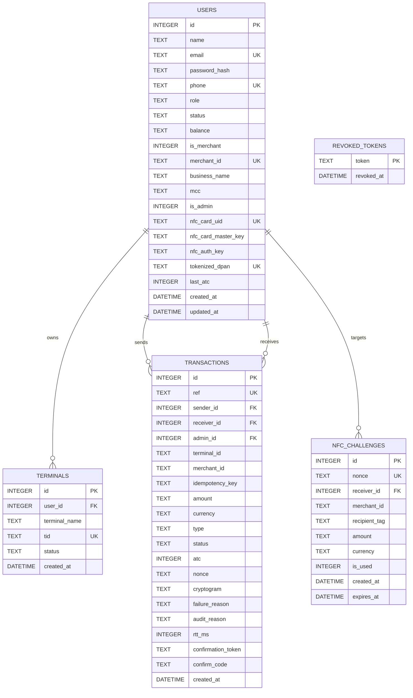

# TeknoNFC — Data Models & Database Schemas

> **Document ID**: `03_DATA_MODELS_AND_SCHEMAS`  
> **Classification**: Data Architecture, Entity-Relationship Models, & DTO Catalog  
> **Generated By**: Full-Project Documenter Skill (Zero-Omission Engine)

---

## 1. Entity-Relationship Diagram (ERD)



---

## 2. Table Dictionaries

### 2.1 Table: `users`
Primary account entity for consumers, merchants, and system administrators.

| Column | Type | Constraints | Default | Description |
| :--- | :--- | :--- | :--- | :--- |
| `id` | `INTEGER` | `PRIMARY KEY AUTOINCREMENT` | - | Unique system user ID |
| `name` | `TEXT` | `NOT NULL` | - | Legal full name or contact person |
| `email` | `TEXT` | `UNIQUE NOT NULL` | - | Primary login email address |
| `password_hash` | `TEXT` | `NOT NULL` | - | SHA-256 password hash |
| `phone` | `TEXT` | `UNIQUE NOT NULL` | - | E.164 phone number |
| `role` | `TEXT` | `NOT NULL` | `'user'` | Role (`user`, `merchant`, `admin`) |
| `status` | `TEXT` | `NOT NULL` | `'active'`| Account status (`active`, `suspended`, `locked`)|
| `balance` | `TEXT` | `NOT NULL` | `'0.0000'`| Fixed-point decimal string balance |
| `is_merchant` | `INTEGER` | `NOT NULL` | `0` | Flag (1 if approved merchant, 0 otherwise) |
| `merchant_id` | `TEXT` | `UNIQUE` | `NULL` | Assigned MID (e.g. `MRCH-YE-770412`) |
| `business_name` | `TEXT` | `NULL` | `NULL` | Commercial DBA business name |
| `mcc` | `TEXT` | `NULL` | `NULL` | 4-digit Merchant Category Code |
| `is_admin` | `INTEGER` | `NOT NULL` | `0` | Super admin privileges flag |
| `nfc_card_uid` | `TEXT` | `UNIQUE` | `NULL` | Physical silicon UID or emulated card identifier |
| `nfc_card_master_key`| `TEXT` | `NULL` | `NULL` | 128-bit Master Derivation Key (hex string) |
| `nfc_auth_key` | `TEXT` | `NULL` | `NULL` | 128-bit Authentication Key (hex string) |
| `tokenized_dpan` | `TEXT` | `UNIQUE` | `NULL` | 16-digit surrogate Device Primary Account Number |
| `last_atc` | `INTEGER` | `NOT NULL` | `0` | Application Transaction Counter monotonic high-water mark |
| `created_at` | `DATETIME` | `NOT NULL` | `CURRENT_TIMESTAMP` | Account creation timestamp |
| `updated_at` | `DATETIME` | `NOT NULL` | `CURRENT_TIMESTAMP` | Last profile update timestamp |

---

### 2.2 Table: `transactions`
Immutable double-entry financial ledger of all payments, reversals, and adjustments.

| Column | Type | Constraints | Description |
| :--- | :--- | :--- | :--- |
| `id` | `INTEGER` | `PRIMARY KEY AUTOINCREMENT` | Auto-incrementing ledger sequence ID |
| `ref` | `TEXT` | `UNIQUE NOT NULL` | Public transaction reference (`tx_uuidv4`) |
| `sender_id` | `INTEGER` | `NULL`, FK `users(id)` | Debit account ID (NULL for faucets/cash loads) |
| `receiver_id` | `INTEGER` | `NULL`, FK `users(id)` | Credit account ID |
| `admin_id` | `INTEGER` | `NULL`, FK `users(id)` | Admin user ID if manually adjusted |
| `terminal_id` | `TEXT` | `NULL` | POS terminal ID (TID) where tap occurred |
| `merchant_id` | `TEXT` | `NULL` | MID associated with accepting terminal |
| `idempotency_key` | `TEXT` | `NULL` | Client-provided idempotency token |
| `amount` | `TEXT` | `NOT NULL` | Fixed-point transaction amount |
| `currency` | `TEXT` | `NOT NULL DEFAULT 'USD'` | ISO 4217 Currency Code (`YER`, `USD`) |
| `type` | `TEXT` | `NOT NULL` | Type (`NFC_HCE_TAP`, `NFC_P2P`, `REVERSAL`, `TOPUP`) |
| `status` | `TEXT` | `NOT NULL` | Status (`PENDING_CONFIRMATION`, `COMPLETED`, `CANCELLED`) |
| `atc` | `INTEGER` | `NULL` | Monotonic ATC submitted during tap |
| `nonce` | `TEXT` | `NULL` | Challenge nonce consumed for this transaction |
| `cryptogram` | `TEXT` | `NULL` | Computed/verified ARQC/TC cryptogram |
| `failure_reason` | `TEXT` | `NULL` | Technical decline or cancellation reason |
| `audit_reason` | `TEXT` | `NULL` | Compliance note or human rationale |
| `rtt_ms` | `INTEGER` | `NULL` | Measured tap latency in milliseconds |
| `confirmation_token`| `TEXT` | `NULL` | Secret UUID token generated for two-phase confirmation |
| `confirm_code` | `TEXT` | `NULL` | 6-digit CSPRNG verification code |
| `created_at` | `DATETIME` | `NOT NULL` | UTC creation timestamp |

---

### 2.3 Table: `nfc_challenges`
Single-use cryptographically unpredictable nonces preventing replay and pre-computation attacks.

| Column | Type | Constraints | Description |
| :--- | :--- | :--- | :--- |
| `id` | `INTEGER` | `PRIMARY KEY AUTOINCREMENT` | Challenge primary key |
| `nonce` | `TEXT` | `UNIQUE NOT NULL` | 16-character hex-encoded CSPRNG nonce |
| `receiver_id` | `INTEGER` | `NOT NULL` | Target merchant or recipient user ID |
| `merchant_id` | `TEXT` | `NULL` | Target Merchant Identifier |
| `recipient_tag` | `TEXT` | `NULL` | Standardized tag (e.g. `MRCH-YE-` or `USER0003`) |
| `amount` | `TEXT` | `NOT NULL` | Authorized amount |
| `currency` | `TEXT` | `NOT NULL DEFAULT 'USD'` | Transaction currency |
| `is_used` | `INTEGER` | `NOT NULL DEFAULT 0` | Flag: 1 if consumed by a tap, 0 otherwise |
| `created_at` | `DATETIME` | `NOT NULL` | Generation timestamp |
| `expires_at` | `DATETIME` | `NOT NULL` | Absolute expiration timestamp (TTL 60s) |

---

## 3. Database Indexes

```sql
CREATE INDEX IF NOT EXISTS idx_users_email ON users(email);
CREATE INDEX IF NOT EXISTS idx_users_nfc_card ON users(nfc_card_uid);
CREATE INDEX IF NOT EXISTS idx_users_dpan ON users(tokenized_dpan);
CREATE INDEX IF NOT EXISTS idx_users_merchant_id ON users(merchant_id);
CREATE INDEX IF NOT EXISTS idx_terminals_user ON terminals(user_id);
CREATE INDEX IF NOT EXISTS idx_challenges_nonce ON nfc_challenges(nonce);
CREATE INDEX IF NOT EXISTS idx_transactions_ref ON transactions(ref);
CREATE INDEX IF NOT EXISTS idx_transactions_created ON transactions(created_at DESC);
CREATE INDEX IF NOT EXISTS idx_transactions_sender ON transactions(sender_id);
CREATE INDEX IF NOT EXISTS idx_transactions_receiver ON transactions(receiver_id);
CREATE INDEX IF NOT EXISTS idx_transactions_conf_token ON transactions(confirmation_token);
```
